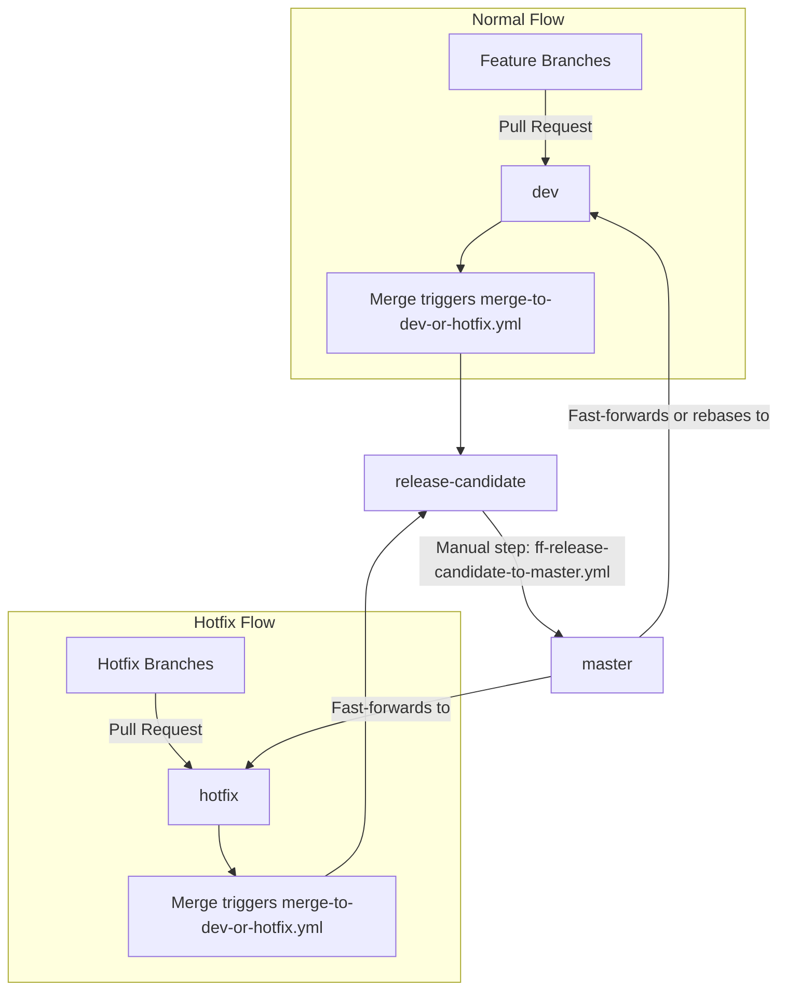

# CI/CD workflows

This repository uses a **Git Flow**‐inspired process with the following branches:

* **feature** branches (e.g. feat/some-cool-feature)
* **dev** for development (collecting features)
* **hotfix** for urgent fixes that need to go to production quickly
* **release-candidate** (staging environment)
* **master** (production)

We have two major paths: **Feature to Dev** and **Hotfix to Hotfix**. In both cases, merging into `dev` or `hotfix` triggers a job that:
* **resets** `release-candidate` to match the incoming branch
* bumps version
* builds a Docker image for staging

Once validated in staging, a manual dispatch of the **Fast forward release-candidate to master** job can fast‐forward `release-candidate` → `master`. At that point, we propagate changes back into `dev` (which may either be fast-forwarded or rebased) and `hotfix` (which is always fast-forwarded).

## High‐Level Diagram

1. Feature branches are merged into dev.
2. Hotfix branches are merged into hotfix.
3. Merging into dev or hotfix triggers our `merge-to-dev-or-hotfix.yml` workflow, which:
   * Resets `release-candidate` to match the just‐merged branch
   * Bumps the version (semantic-release)
   * Builds and pushes a Docker image (with a tag like `vX.X.X-SHA`)
   * Deploys it to staging.
4. Once validated in staging, we manually trigger `ff-release-candidate-to-master.yml` to **fast‐forward** `release-candidate` → `master`.
5. A Docker image is tagged as `latest` and deployed to production.
6. We then attempt to fast‐forward `master` into `dev` and `hotfix`. If `dev` has additional commits not in `master`, the pipeline automatically rebases instead, while `hotfix` is always fast-forwarded.

## Detailed Workflows
Below is a breakdown of each .yml file’s responsibilities and when they run.

### 1. checks.yml

* Triggers on all branches and all tags.
* Performs:
  * Setup (Node install, caching)
  * Lint
  * Test
* If the branch is `dev` or it’s a tag, then it also builds & pushes an image, and optionally deploys.

This is our "global CI check" pipeline. It ensures code quality and runs unit tests on every commit.

### 2. merge-to-dev-or-hotfix.yml

* **Triggers** on `push` events to either the `dev` branch or the `hotfix` branch.
* Once a PR merges into `dev` or `hotfix`, this workflow does:
  1. **Reset**` release-candidate` = `dev` (or hotfix)
  2. **Bump** version (via Semantic Release) on `release-candidate`
  3. **Build** Docker image from `release-candidate`
  4. **Tag** the built image (usually "staging")

This means that every merge into `dev` or `hotfix` automatically flows into `release-candidate` for our staging environment.

### 3. ff-release-candidate-to-master.yml
* Manually triggered with workflow_dispatch.
* Steps:
  * **Fast‐forward** `master` from `release-candidate`.
  * **Tag** the image with `latest` for production.
  * **Create a Git tag** for the release and push it to the remote.
  * **Attempt** to fast‐forward `dev` from `master`. If it **fails** (because `dev` is ahead), we rebase `dev` on top of `master`.
  * **Fast‐forward** `hotfix` from `master` (which is always fast-forwarded).

This is the final step in releasing to production. `master` is updated, a production image is pushed, and we sync `dev` (which may be rebased) and `hotfix` (which is always fast-forwarded) so that everything is consistent with production.

### 4. reset.yml
* Used by **merge-to-dev-or-hotfix.yml** to reset `release-candidate` to whichever branch was just merged (`dev` or `hotfix`).
* Runs `git reset --hard origin/<base-ref>` and force-pushes back to `<target-ref>`.

### 5. bump.yml
* Also used in **merge-to-dev-or-hotfix.yml** after the reset.
* Runs `semantic-release` to automatically determine if the version should be patch/minor/major, then commits and pushes the new `package.json` amd `package-lock.json` version.

### 6. build.yml
* Builds and pushes a Docker image to GitHub Container Registry (GHCR).
* The image tag is typically `<package.json version>-<git SHA>`.

### 7. tag-image.yml
* **After** building an image, we sometimes want an additional “friendly” tag. E.g., `latest` for `master` or `staging` for `release-candidate`.
* This workflow pulls the previously built image and re‐tags/pushes it to GHCR.

### 8. fast-forward.yml
* Called to do a `--ff-only` merge from a source branch (e.g. `release-candidate`) to a target branch (e.g. `master`).
* If there are commits on the target branch that aren’t in the source, fast-forward fails. That’s when we fallback to `rebase.yml`.

### 9. rebase.yml
* Fallback workflow that rebases the target branch on top of the base branch (e.g. rebasing `dev` on `master`).
* This creates a linear history (no merge commit) but requires rewriting the target branch’s commits.
* We do a **force push** afterward, because rebasing changes commit SHAs.

## Scenarios & How the Pipelines Behave
Below are the main scenarios to illustrate how merges/fast‐forwards/rebases happen.

### A. Normal Feature Flow (feat → dev → rc → master)
1. **Feature** branches get merged into `dev`.
2. **merge-to-dev-or-hotfix.yml** triggers:
  * Resets `release-candidate` = `dev`
  * Bumps version on `release-candidate`
  * Builds & tags a Docker image for staging
3. **Manual check** & QA on staging environment.
4. **Manually trigger** `ff-release-candidate-to-master.yml`:
  * **Fast‐forward** `master` ← `release-candidate`
  * Tag Docker image as `latest`
  * Attempt **fast‐forward** `dev` from `master`
    * If `dev` has commits not in `master`, it rebases onto `master`.

### B. Hotfix Flow (fix → hotfix → rc → master)
1. **Hotfix** branch merges into `hotfix`.
2. Same pipeline triggers:
  * Resets `release-candidate` = `hotfix`
  * Bumps version on `release-candidate`
  * Builds & tags the Docker image for staging
3. **Manual check** & QA on staging environment.
4. **Manually trigger** `ff-release-candidate-to-master.yml` again:
     * Fast‐forward `master` ← `release-candidate`
     * Tag Docker image as latest
     * Attempt **fast‐forward** `hotfix` from `master`
     * Attempt **fast‐forward** `dev` from `master` so that dev doesn’t miss the hotfix. If `dev` is ahead, it’s **rebased** on `master`.

### C. Dev Already Has New Commits When a Hotfix Lands
1. `dev` has some new commits that are not yet in `master`.
1. A critical `hotfix` is merged into `hotfix`.
1. `release-candidate` is reset to `hotfix`, version is bumped, image is built.
1. We fast‐forward master from `release-candidate`.
1. Pipeline tries to **fast‐forward** `master` → `dev`.
    * Fails, because dev has commits not in master.
    * So we run rebase.yml, replaying dev’s new commits on top of master.
    * No merge commit is created; dev is force‐pushed with rewritten commits.
In this way, dev now contains both the new hotfix and its own new commits.

## When Do We Fast‐Forward vs. Rebase?
* **Fast‐forward** (`git merge --ff-only`) is attempted whenever we synchronize from `master` to `dev`/`hotfix`:
  * If the target branch is strictly behind `master`, the fast‐forward is successful, and no extra commit is introduced.
  * If the target branch has diverged (i.e., it has commits that `master` doesn’t), a fast‐forward is not possible.
* Rebase is the fallback when fast‐forward fails. We replay `dev` (or `hotfix`) commits on top of `master`, creating a linear history but rewriting commit SHAs. A force push is required to update the remote.

## FAQ

**1. Why not always use rebase?**

    We prefer a fast‐forward merge when possible, because it does not rewrite commits. If a branch is strictly behind master, a fast‐forward is the cleanest approach.
**1. Why do we force‐push on rebase?**

    Because rebasing changes commit SHAs, we must overwrite the remote branch with the new commits.

**1. What if a developer has already pulled the old dev commits locally?**

    They will have to git pull --rebase or otherwise re-sync. This is an accepted tradeoff for having a linear history with no merge commit.

**1. How do we ensure staging is consistent?**

    Whenever code merges into dev or hotfix, we rebuild & redeploy on release-candidate. That environment is staging. Once tested, we promote the same commits (fast‐forward) into master.

## File Reference

Below is a quick reference to each workflow files.

Workflow files in the individualt repositories:

* **checks.yml** – Runs on every commit/branch/tag to do lint, test, optional build & deploy.
* **merge-to-dev-or-hotfix.yml** – Resets `release-candidate` = `dev`/`hotfix`, bumps version, builds image.
* **ff-release-candidate-to-master.yml** – Manual workflow to fast‐forward `master` from `release-candidate`, then sync changes back to `dev` and `hotfix` (fast‐forward or rebase).

Shared workflow files (lives in this repo):

* **build.yml** – Called to build & push Docker images.
* **bump.yml** – Bumps `package.json` version with semantic‐release.
* **fast-forward.yml** – Utility workflow that merges with `--ff-only`.
* **rebase.yml** – Replays target branch on top of a base branch (force push).
* **reset.yml** – Hard resets one branch to another.
* **tag-image.yml** – Pull an existing image, re‐tag, and push under a new name.