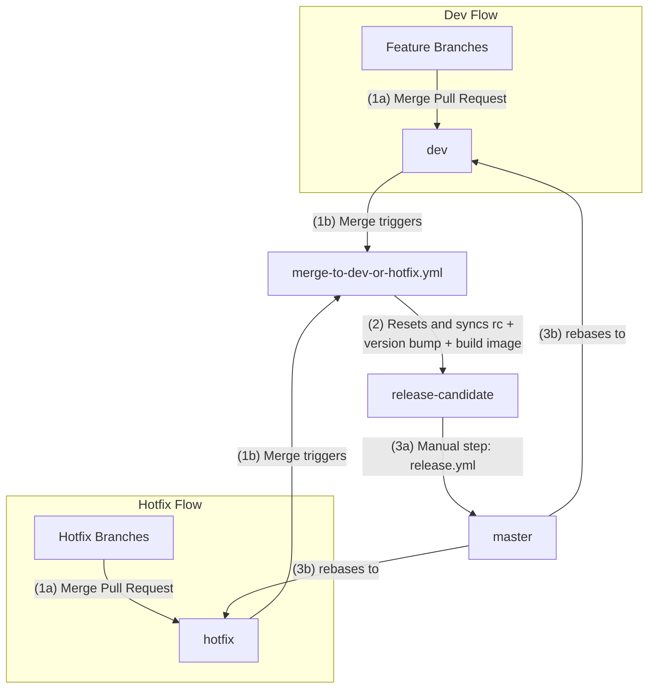

# CI/CD workflows

- [CI/CD workflows](#cicd-workflows)
  - [High‐Level Diagram](#highlevel-diagram)
    - [Normal Flow](#normal-flow)
    - [Hotfix Flow](#hotfix-flow)
  - [Detailed Workflows](#detailed-workflows)
    - [Main Repository Workflows (each repository)](#main-repository-workflows-each-repository)
      - [1. pull-request.yml](#1-pull-requestyml)
      - [2. merge-to-dev-or-hotfix.yml](#2-merge-to-dev-or-hotfixyml)
      - [3. release.yml](#3-releaseyml)
    - [Shared Workflow Files (This Repository)](#shared-workflow-files-this-repository)
      - [1. reset.yml](#1-resetyml)
      - [2. build-image.yml](#2-build-imageyml)
      - [3. bump.yml](#3-bumpyml)
      - [4. tag-image.yml](#4-tag-imageyml)
      - [5. fast-forward.yml](#5-fast-forwardyml)
      - [6. rebase.yml](#6-rebaseyml)
      - [7. git-tag-github-release.yml](#7-git-tag-github-releaseyml)
      - [8. check-version-bump.yml](#8-check-version-bumpyml)
      - [9. check-workflow-status.yml](#9-check-workflow-statusyml)
      - [10. check-tag-version-equality.yml](#10-check-tag-version-equalityyml)

This repository uses a **Git Flow**‐inspired process with the following branches:

- **feature** branches (e.g. feat/some-cool-feature)
- **dev** for development (collecting features)
- **hotfix** for urgent fixes that need to go to production quickly
- **release-candidate** (staging environment)
- **master** (production)

We have two major paths: **Feature to Dev** and **Hotfix to Hotfix**. In both cases, merging into `dev` or `hotfix` triggers a job that:

- **resets** `release-candidate` to match the incoming branch
- bumps version
- builds a Docker image for staging

Once validated in staging, a manual dispatch of the **Fast forward release-candidate to master** job can fast‐forward `release-candidate` → `master`. Which does:

1. forwards `release-candidate` changes to master (including the version bump commit)
2. makes the image available to production environment
3. propagate changes back into `dev` and `hotfix` via rebase

This ensures `dev` and `hotfix` is always up to date with master.

## High‐Level Diagram

### Normal Flow

1. **Code Integration**: Branches are merged to either `dev` or `hotfix`
   - Merge triggers `merge-to-dev-or-hotfix.yml` workflow
2. **Staging Preparation**: `merge-to-dev-or-hotfix.yml` workflow:
   - Resets `release-candidate` to match the merged branch
   - Bumps version using `conventional-recommended-bump`
   - Builds and pushes Docker image (`vX.X.X-SHA`) to staging environment (**NOTE:** deployment not automatic)
3. **Production Release**: After staging validation, manually trigger `release.yml`:
   - Fast-forwards `master` to match `release-candidate`
   - Tags Docker image as `latest` for production (**NOTE:** deployment not automatic)
   - Creates and pushes Git tag and creates a GitHub release
   - Rebases both `hotfix` and `dev` branch onto `master`

### Hotfix Flow

1. **Initial State**: Commit `A` merges to `dev`

   - `release-candidate` is reset to `dev`, version-bumped (commit `B`)
   - `release-candidate` now contains: `A` + `B`

   | Branch              | Commits            |
   | ------------------- | ------------------ |
   | `master`            | (previous commits) |
   | `release-candidate` | `A` + `B`          |
   | `dev`               | `A`                |
   | `hotfix`            | (previous commits) |

2. **Hotfix Process**: Fix (commit `C`) merges to `hotfix` branch

   - `release-candidate` is reset to `hotfix`, replacing commits `A` and `B` with `C`, then is version-bumped (commit `D`)
   - `release-candidate` now contains: `C` + `D`

   | Branch              | Commits            |
   | ------------------- | ------------------ |
   | `master`            | (previous commits) |
   | `release-candidate` | `C` + `D`          |
   | `dev`               | `A`                |
   | `hotfix`            | `C`                |

3. **Production Release**: Manual trigger of `release.yml`
   - `master` is fast-forwarded to match `release-candidate` (`C` + `D`)
   - `hotfix` is rebased on `master` (synced with `C` + `D`)
     | Branch | Commits |
     |-------------------|------------------------|
     | `master` | `C` + `D` |
     | `release-candidate` | `C` + `D` + `A` + `B` |
     | `dev` | `C` + `D` + `A` |
     | `hotfix` | `C` + `D` |

Result: All branches contain the hotfix (`C` + `D`). The development work (`A`) remains in `dev` and `release-candidate`, ready for the next production release via the same process.

## Detailed Workflows

Below is a breakdown of each workflow file's responsibilities and when they run.

### Main Repository Workflows (each repository)

These workflows lives in each of the individual repository.

#### 1. pull-request.yml

- Triggers on pull request events
- Performs:
  - Setup (Node install, caching)
  - Lint
  - TypeScript build and type checks
  - Test

This is our PR check pipeline. It ensures code quality, builds and type correctness, and all tests are passing.

#### 2. merge-to-dev-or-hotfix.yml

- **Triggers** on `push` events to either the `dev` branch or the `hotfix` branch.
- Once a PR merges into `dev` or `hotfix`, this workflow does:
  1. **Reset**` release-candidate` = `dev` (or hotfix)
  2. **Bump** version (via `conventional-recommended-bump`) on `release-candidate`
  3. **Builds** a Docker image from `release-candidate`
  4. **Tag** the built image with `staging` (**NOTE:** deployment is not done automatically)

This means that every merge into `dev` or `hotfix` automatically flows into `release-candidate` for our staging environment.

#### 3. release.yml

This job is manually triggered in the GitHub Actions UI once staging testing passed. This is the final step in releasing to production.

- Manually triggered in the GitHub Actions UI (i.e. workflow_dispatch)
- Steps:
  - **Fast‐forwards** `master` from `release-candidate`.
  - **Tags** the Docker image with `latest` for production.
  - **Creates** a Git tag and a GitHub release
  - Uses **rebase** to sync `hotfix` from `master`.
  - Uses **rebase** to sync `dev` from `master`.

`master` is updated, a production image is pushed, and we sync `dev` and `hotfix` via rebase so that everything is consistent with production.

### Shared Workflow Files (This Repository)

#### 1. reset.yml

- Used by **merge-to-dev-or-hotfix.yml** to reset `release-candidate` to whichever branch was just merged (`dev` or `hotfix`).
- Runs `git reset --hard origin/<base-ref>` and force-pushes back to `<target-ref>`.

#### 2. build-image.yml

- Builds and pushes a Docker image to GitHub Container Registry (GHCR).
- The image tag is typically `<package.json version>-<git SHA>`.

#### 3. bump.yml

- Also used in **merge-to-dev-or-hotfix.yml** after the reset.
- Runs `conventional-recommended-bump` to automatically determine if the version should be patch/minor/major, then commits and pushes the new `package.json`

#### 4. tag-image.yml

- **After** building an image, we sometimes want an additional "friendly" tag. E.g., `latest` for `master` or `staging` for `release-candidate`.
- This workflow pulls the previously built image and re‐tags/pushes it to GHCR.

#### 5. fast-forward.yml

- Called to do a `--ff-only` merge from a source branch (e.g. `release-candidate`) to a target branch (e.g. `master`).
- If there are commits on the target branch that aren't in the source, fast-forward fails. That's when we fallback to `rebase.yml`.

#### 6. rebase.yml

- Uses rebase to sync the target branch from the source branch
- A **force push** is required after rebasing, as the commit SHAs will change.

#### 7. git-tag-github-release.yml

- Creates a new Git tag in the format `v<version>` from the package.json version value.
- Pushes the newly created tag to the remote repository.
- Creates a GitHub release

#### 8. check-version-bump.yml

- Validates if commits on a given reference compared to the latest git tag will trigger a version bump.
- Outputs `triggers_bump` and `bump_type`.

#### 9. check-workflow-status.yml

- Checks if a specified workflow with a particular status exists and either fails or continues based on configuration.
- Useful to prevent concurrent workflow executions.

#### 10. check-tag-version-equality.yml

- Compares the version in package.json against the latest git tag version.
- Fails if they are identical, ensuring meaningful version increments.
